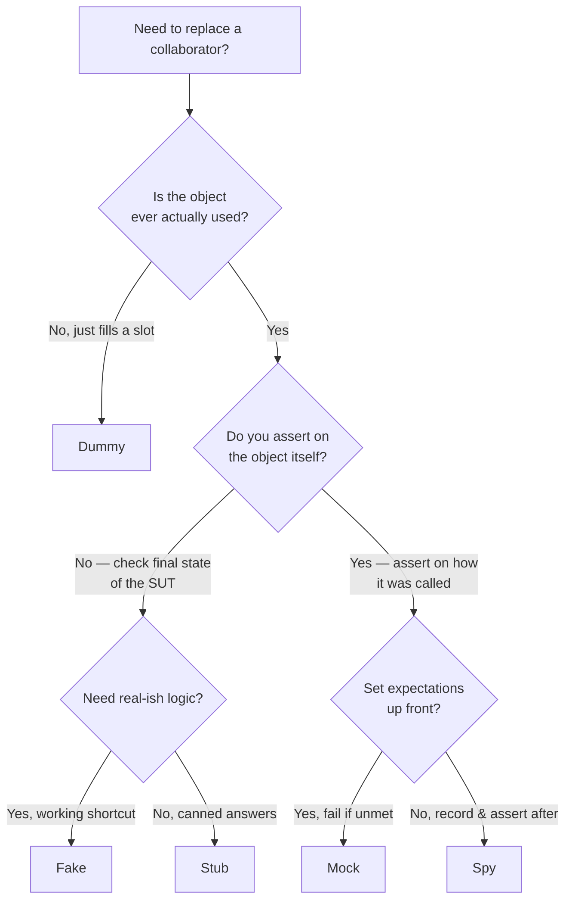

# Test Doubles & the Mocking Taxonomy

A **test double** is any object you substitute for a real collaborator in a test — the
name is Gerard Meszaros's (from *xUnit Test Patterns*, 2007) and is a nod to a Hollywood
"stunt double." Martin Fowler popularized the vocabulary in *Mocks Aren't Stubs* and the
*TestDouble* bliki entry. Interviewers use this topic to see whether you know the precise
differences between the five kinds of doubles, when each is appropriate, and — the senior
signal — when *not* to reach for a mocking framework at all.

The precise terms matter because in casual speech everyone says "mock" for any fake object,
but the words denote different things: only a **mock** carries expectations and is *verified*.
This guide layers each concept: a plain definition and motivation, then trade-offs and
comparisons, then the internals and gotchas an interviewer probes. Concepts are stated
framework-neutrally first, then shown with JUnit 5 + Mockito (Mockito 5.x, the current line).

> [!KEY-TAKEAWAY]
> All five doubles replace a real collaborator, but they differ on two axes: (1) do they
> have logic/behavior, and (2) is the *test* asserting on the object's returned state
> (state verification) or on *how the object was called* (behavior verification).
> Dummy → nothing; Stub → canned answers; Fake → real-ish working shortcut; Spy → records
> calls; Mock → pre-set expectations that are verified.

---

## The test-double taxonomy: dummy, stub, spy, mock, fake

Meszaros defines five categories. Fowler summarizes them in *TestDouble*:

| Double | Has behavior? | Purpose | Verified against? |
|---|---|---|---|
| **Dummy** | No | Fills a parameter list; never actually used | Nothing |
| **Stub** | Minimal | Provides canned answers to calls made during the test | State (indirect) |
| **Fake** | Yes (shortcut) | A working implementation unfit for production (e.g. in-memory DB) | State |
| **Spy** | Minimal | A stub that *also records* how it was called | Recorded interactions |
| **Mock** | Minimal | Pre-programmed with *expectations* forming a spec of expected calls | Behavior (interactions) |

The classification is about the *role the object plays in the test*, not about which
library created it. Mockito can produce something that behaves as a dummy, stub, spy, or
mock; the distinction is how you *use and verify* it. A common umbrella confusion:
"mock object" (a specific double) vs "Mock" the noun people use for *any* double — always
clarify which you mean in an interview.



> [!WARNING]
> The "set expectations up front" vs "record then assert after" split above is a
> *framework-era* distinction, not a law about mocks. Classic frameworks (EasyMock, jMock)
> used a **record → replay → verify** cycle: you declared the expected calls *before* exercising
> the SUT, and verification happened implicitly at replay. **Mockito deliberately unified the
> model** around **arrange → act → verify**: you create a plain `mock(...)`, exercise the SUT,
> then call `verify(...)` *after the fact*. So a Mockito "mock" still does behavior verification —
> it just expresses expectations *after* the act rather than up front. That is why every Mockito
> example below (and the `## Mocks` section, titled "verified after the fact") arranges, acts,
> then verifies: the taxonomy's Mock/Spy line is about *intent* (assert on interactions), not
> about *when* you write the assertion.

> [!INTERVIEW]
> "What is the difference between a mock and a stub?" is the single most common question
> on this topic. Answer: a **stub** provides canned answers so the SUT can run; you verify
> the *result/state*. A **mock** has *expectations* about which calls it should receive;
> you verify the *interaction*. A stub failing a test means the SUT produced the wrong
> output; a mock failing means the SUT talked to its collaborator incorrectly.

## Dummy objects

A **dummy** is passed around to satisfy a method signature or constructor but is never
actually exercised — its methods are never meaningfully called. Its only job is to let the
code compile and run.

```java
// The SUT's constructor requires an AuditLog, but this test path never audits.
AuditLog dummy = mock(AuditLog.class);          // never stubbed, never verified
var service = new OrderService(repo, dummy);
```

Passing `null` is the crudest dummy; a `mock(...)` with no stubbing is a safer dummy because
if the code *does* unexpectedly call it, a mock returns benign defaults (0, false, empty,
`null`) rather than throwing an NPE from a null reference. If you find yourself stubbing a
"dummy," it has graduated to a stub. Dummies signal *irrelevance* — they document that this
collaborator plays no part in the behavior under test.

## Stubs: canned answers for indirect inputs

A **stub** provides hard-coded ("canned") responses to the calls the SUT makes during a
test, and ignores everything else. Stubs feed **indirect inputs** into the SUT — data the
SUT pulls from a collaborator rather than receiving directly as arguments. You then assert
on the SUT's output or final state; you do *not* assert on the stub.

```java
@Test
void appliesDiscountForGoldCustomers() {
    CustomerRepository repo = mock(CustomerRepository.class);
    when(repo.findTier("c1")).thenReturn(Tier.GOLD);   // canned answer = stub

    Money total = pricing.quote("c1", cart);

    assertThat(total).isEqualTo(Money.of(90));         // state verification
    // note: no verify(repo)... — that's the point of a stub
}
```

Stubs can also inject *error paths* — a stub that throws lets you test how the SUT handles a
`TimeoutException` without needing the real dependency to actually time out
(`when(repo.find(any())).thenThrow(new TimeoutException())`). Over-specific stubbing (e.g.
`eq("c1")`) can make tests brittle; use argument matchers judiciously.

> [!WARNING]
> A stub that is set up but whose canned value the SUT never reads is an **unnecessary
> stubbing**. Mockito's default `STRICT_STUBS` mode (via `MockitoExtension`) fails the test
> for these, because they usually indicate a copy-paste mistake or a misunderstanding of
> what the SUT actually calls.

## Fakes: lightweight working implementations

A **fake** has a real, working implementation but takes a shortcut that makes it unsuitable
for production. The canonical example is an **in-memory repository** or an in-memory
database (H2, SQLite in-memory) standing in for a real datastore. Unlike a stub, a fake
contains *logic* — you can `save()` then `findById()` and get your object back.

```java
class InMemoryOrderRepository implements OrderRepository {
    private final Map<String, Order> store = new ConcurrentHashMap<>();
    public void save(Order o)          { store.put(o.id(), o); }
    public Optional<Order> find(String id) { return Optional.ofNullable(store.get(id)); }
    public List<Order> findAll()       { return List.copyOf(store.values()); }
}
```

Fakes shine when many tests need round-trip behavior and stubbing every call would be
tedious and fragile. Trade-offs: a fake is *code you must maintain and test itself*, and it
can silently drift from the real implementation's semantics (an in-memory map won't enforce
unique constraints, transaction isolation, or SQL quirks). That fidelity gap is exactly why
teams increasingly prefer **Testcontainers** (a real Postgres/Redis in Docker) over hand-
written fakes for integration-level confidence — see
`testing/testcontainers-for-integration-testing`.

## Spies: stubs that record how they were called

A **spy** is a stub that additionally *records* information about how it was called, so the
test can assert on those interactions afterward. Fowler's example: a fake email gateway that
records how many messages it was asked to send.

Note the two distinct meanings of "spy":

1. **Meszaros's test-double spy** — a hand-written recording double (record calls, assert
   after the fact). This is *behavior verification done in a record-then-assert style*.
2. **Mockito's `spy(...)` / `@Spy`** — a **partial mock**: it *wraps a real object* so real
   methods run by default, but you can stub selected methods and verify calls.

```java
// Mockito partial spy — real methods run unless stubbed
List<String> real = new ArrayList<>();
List<String> spy = spy(real);
spy.add("a");                       // REAL add runs
verify(spy).add("a");               // interaction recorded & verified
doReturn("x").when(spy).get(0);     // must use doReturn — see gotcha below
```

> [!WARNING]
> With a Mockito spy, `when(spy.get(0)).thenReturn("x")` **actually calls the real
> `get(0)`** during stub setup (throwing `IndexOutOfBoundsException` on an empty list).
> Use the `doReturn(...).when(spy).get(0)` form, which does not invoke the real method.

## Mocks: pre-set expectations verified after the fact

A **mock** is pre-programmed with **expectations** — a specification of the calls it should
(and sometimes should not) receive. The test *verifies* those interactions occurred; failing
to meet an expectation fails the test. Mocks are the tool of **behavior verification**: you
are asserting on *how the SUT collaborated*, not on a returned value.

```java
@Test
void publishesEventWhenOrderPlaced() {
    EventBus bus = mock(EventBus.class);
    var service = new OrderService(repo, bus);

    service.place(order);

    verify(bus).publish(new OrderPlaced("o1"));   // expectation on interaction
    verifyNoMoreInteractions(bus);                // no other calls allowed
}
```

Mocks are ideal for verifying **command-style** collaborators with side effects you cannot
otherwise observe — sending email, publishing events, writing to a queue — where there is no
convenient state to assert on. The danger is *coupling the test to the implementation*: a
mock-heavy test asserts the exact sequence and shape of calls, so an internal refactor that
preserves behavior can still break the test (see over-mocking, below).

## State verification vs behavior verification

This is the conceptual heart of the topic and the reason mocks and stubs feel different.

- **State verification** — exercise the SUT, then assert on the *resulting state* (return
  value or observable state of the SUT / a fake). The collaborator is a stub or fake; you do
  not care *how* it was called, only that the end result is correct.
- **Behavior verification** (a.k.a. interaction testing) — assert on the *interactions* the
  SUT had with its collaborators (which methods, with which arguments, how many times). The
  collaborator is a mock or spy.

```java
// STATE verification                         // BEHAVIOR verification
when(rates.usdToEur()).thenReturn(0.9);        var notifier = mock(Notifier.class);
Money out = converter.convert(usd(100));       service.deactivate(user);
assertThat(out).isEqualTo(eur(90));            verify(notifier).sendGoodbye(user.email());
```

> [!TIP]
> Prefer state verification when the operation returns or changes observable state (a
> "query"); prefer behavior verification for side-effecting "commands" with no observable
> return (Command-Query Separation is a useful lens). Asserting behavior on a *query*
> over-specifies the test; asserting state on a fire-and-forget *command* often can't be done
> without a mock or a fake that records.

## Mocks aren't stubs (Fowler's distinction)

Fowler's essay *Mocks Aren't Stubs* draws the line explicitly: **stubs use state
verification; mocks use behavior verification.** A stub helps the SUT produce a result you
then check; a mock is itself the thing being checked. Two practical corollaries:

- A test can be *rewritten* to use a stub instead of a mock (or vice versa) and it will test
  a different thing — one checks output, the other checks collaboration.
- Overusing mocks couples tests to the *how* (implementation), while stubs+state assertions
  couple to the *what* (contract/outcome), which usually survives refactoring better.

The essay also introduces the two design schools built on this distinction.

## Classical (Detroit) vs mockist (London) TDD

The choice of doubles maps onto two TDD schools:

| | **Classical / Detroit / "classicist"** | **Mockist / London / "outside-in"** |
|---|---|---|
| Default double | Real objects; stubs/fakes only for awkward collaborators (DB, network) | Mock nearly every collaborator of the SUT |
| Verification style | State verification | Behavior verification |
| Unit boundary | A *behavior* may span several cooperating classes | One class = one unit; neighbors mocked |
| Design driver | Tests confirm results | Tests drive *roles/protocols* between objects (GOOS) |
| Refactor resilience | High (tests don't see internals) | Lower (tests encode call structure) |
| Failure localization | A bug can break many tests (cascade) | Failing test pinpoints the exact class |

Classical TDD traces to Kent Beck (Detroit, birthplace of XP). Mockist/London-school TDD is
associated with Steve Freeman & Nat Pryce's *Growing Object-Oriented Software, Guided by
Tests* (GOOS), which uses mocks to discover the interfaces (roles) between objects. Most
practitioners blend the two: state-based where there's a return value, interaction-based for
side-effecting boundaries.

## Over-mocking and mocking types you don't own

**Over-mocking** is the anti-pattern of replacing so many collaborators with mocks that the
test verifies the SUT's internal call choreography rather than its behavior. Symptoms: tests
that break on every refactor, mock setup longer than the assertions, and tests that pass even
when the feature is broken (because everything the SUT touched was faked).

> [!WARNING]
> **Don't mock types you don't own** (a core Mockito guideline). Mocking a third-party or
> JDK type (`HttpClient`, an AWS SDK client, a JDBC `ResultSet`) bakes *your assumptions*
> about that library's contract into the test. If the real library behaves differently — or
> a version upgrade changes behavior — your mock still "passes," giving false confidence.
> Instead, wrap the third-party type behind a thin **adapter interface you own**, mock the
> adapter in unit tests, and cover the adapter itself with an integration test (Testcontainers,
> WireMock) against the real thing.

Related guidance: **don't mock value objects** (data holders like `Money`, `LocalDate`,
DTOs) — just construct real instances; they have no behavior worth faking. Also avoid
mocking the class under test itself.

## Test-induced design damage

Coined by David Heinemeier Hansson (and debated with Fowler & Beck in the "Is TDD Dead?"
series), **test-induced design damage** is when the desire for isolated, mock-friendly tests
distorts production design in harmful ways: excessive indirection, interfaces with a single
implementation created only so they can be mocked, dependency injection ceremony, and logic
split across many thin classes purely to make each mockable.

The senior nuance: *some* pressure from testing improves design (it surfaces hidden
dependencies and tight coupling — "listen to your tests"). The damage is when you add
abstraction with no value other than testability. A pragmatic response is to test at a
slightly coarser grain (test a small cluster of classes together with real objects, mock only
at true boundaries), so you don't need a seam at every internal edge.

## Seams and dependency injection for testability

A **seam** (Michael Feathers, *Working Effectively with Legacy Code*) is "a place where you
can alter behavior in your program without editing in that place." Seams are what let you
insert a test double. The cleanest seam is **constructor dependency injection**: the SUT
receives its collaborators, so a test passes doubles instead of the real ones.

```java
class OrderService {
    private final OrderRepository repo;
    private final Clock clock;                    // inject Clock — a seam for time
    OrderService(OrderRepository repo, Clock clock) { this.repo = repo; this.clock = clock; }
    // production: new OrderService(realRepo, Clock.systemUTC());
    // test:       new OrderService(fakeRepo, Clock.fixed(instant, UTC));
}
```

Common seams: constructor/setter injection, passing a `Clock`/`Supplier` for time and
randomness (instead of calling `Instant.now()`/`new Random()` inline), factory parameters,
and interfaces at process boundaries. Code that `new`s its dependencies internally or reaches
for statics/singletons has *no seam* and is hard to test — which is why static utility calls
and `new` inside business logic are testability smells. In Spring, the container is the DI
mechanism; for pure unit tests you typically bypass the container and inject doubles directly.
The Spring-specific slice testing (`@WebMvcTest`, `@DataJpaTest`, `@MockBean`) is covered in
`spring-boot/testing-spring-boot-applications`.

## Mockito strictness and common pitfalls

Modern Mockito (via `@ExtendWith(MockitoExtension.class)` in JUnit 5) defaults to
`Strictness.STRICT_STUBS`, which:

- fails the test on **unnecessary stubbing** (a `when(...)` whose value is never used), and
- reports **argument mismatches** clearly (stubbed `find("a")` but SUT called `find("b")`).

```java
@ExtendWith(MockitoExtension.class)              // STRICT_STUBS by default
class PricingTest {
    @Mock CustomerRepository repo;               // Mockito creates the mock
    @InjectMocks PricingService pricing;         // injects @Mock fields into the SUT
    // ...
}
```

Gotchas interviewers like:

- **`when()` vs `doReturn()`** — `when(x.foo()).thenReturn(v)` calls `x.foo()` during setup;
  fine for a pure mock, but on a **spy** or a partial mock it invokes the real method. Use
  `doReturn(v).when(x).foo()` to avoid that, and for methods returning `void` or when stubbing
  spies.
- **Cannot mock final/static by default in old versions** — Mockito 2+ can mock finals with
  the inline mock maker (default in Mockito 5); `mockStatic(...)` mocks statics but is a smell
  ("don't mock what you don't own").
- **`verify` counts** — `verify(m, times(2))`, `never()`, `atLeastOnce()`,
  `verifyNoInteractions(m)`. Over-using `verifyNoMoreInteractions` makes tests brittle.
- **Argument matchers are all-or-nothing** — if one argument uses a matcher (`any()`), all
  must; mix a raw value with `eq(...)`.
- **`@InjectMocks` is best-effort** — it silently leaves a field `null` if it can't match a
  mock, which surfaces later as a confusing NPE.

## Common follow-up questions

- **"What's the difference between a mock and a stub?"** Stub = canned answers, verify state;
  mock = pre-set expectations, verify interactions. (Fowler: *Mocks Aren't Stubs*.)
- **"When would you use a fake instead of a mock?"** When many tests need real round-trip
  behavior (save/retrieve), or when mocking every call would be brittle — e.g. an in-memory
  repository. Consider Testcontainers when fidelity matters.
- **"Why shouldn't you mock types you don't own?"** You encode assumptions about a library's
  contract; upgrades or misunderstandings give false passes. Wrap them behind an owned
  adapter and integration-test the adapter.
- **"Classical vs London/mockist TDD — which do you use?"** Explain the state-vs-interaction
  trade-off and refactor resilience; most engineers blend them.
- **"How do you make time-dependent code testable?"** Inject a `Clock` (a seam) and use
  `Clock.fixed(...)`; don't call `Instant.now()` inline.
- **"Your team's tests break on every refactor — why?"** Likely over-mocking / behavior
  verification of internals; move toward state verification and mock only at boundaries.
- **"Why does `when(spy.get(0))...` blow up?"** It calls the real method during stubbing; use
  `doReturn(...).when(spy).get(0)`.
- **"What is test-induced design damage?"** Distorting production design (needless interfaces,
  indirection) solely to enable mocking.

## References

- Martin Fowler, *TestDouble* — https://martinfowler.com/bliki/TestDouble.html
- Martin Fowler, *Mocks Aren't Stubs* — https://martinfowler.com/articles/mocksArentStubs.html
- Gerard Meszaros, *xUnit Test Patterns* (2007) — test double taxonomy.
- Mockito documentation & Javadoc — https://site.mockito.org/ and
  https://javadoc.io/doc/org.mockito/mockito-core/latest/org/mockito/Mockito.html
- Steve Freeman & Nat Pryce, *Growing Object-Oriented Software, Guided by Tests* (GOOS).
- Kent Beck, *Test-Driven Development: By Example*.
- Michael Feathers, *Working Effectively with Legacy Code* (seams).
- David Heinemeier Hansson, *Test-induced design damage* — https://dhh.dk/2014/test-induced-design-damage.html
- JUnit 5 User Guide — https://junit.org/junit5/docs/current/user-guide/
