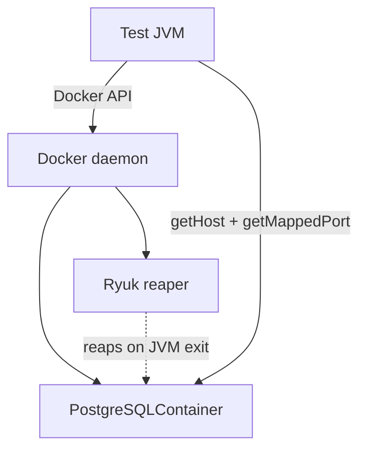

# Testcontainers for Integration Testing

Testcontainers is a library that lets your tests spin up **real dependencies**
— PostgreSQL, Kafka, Redis, Elasticsearch, an SMTP server, even an arbitrary
Docker image — as throwaway Docker containers, wired into the test at runtime
and torn down automatically afterwards. Instead of substituting an in-memory
fake (H2 for a database, an embedded broker) you run the *actual* engine your
production system uses, so the test exercises the real driver, the real SQL
dialect, the real wire protocol.

It exists in the JVM ecosystem (`org.testcontainers`) but the same project ships
for Go, .NET, Python, Node and others; the concepts below are language-neutral
even though the examples are JUnit 5 / Java.

> [!INTERVIEW]
> The core probe is a trade-off question: *"Why not just use H2 / an embedded
> broker? Testcontainers is slow and needs Docker."* A strong answer names the
> **fidelity** gain (real dialect, real protocol, catches bugs fakes hide), the
> **cost** (Docker dependency + startup time), and the mitigations (static /
> singleton containers, reuse, layered pyramid so only a slice of tests need
> containers).

This topic owns the general Testcontainers discipline. Spring-specific test
slices (`@DataJpaTest`, `@SpringBootTest`) live in the `spring-boot` /
`spring-core` domains; the broader integration-testing discipline (narrow vs
broad, flakiness, contract tests) lives in `integration-testing-strategies`.

---

## Why Testcontainers over in-memory fakes

The classic alternative to a real dependency in a test is an **in-memory fake**:
H2 or HSQLDB standing in for PostgreSQL, an embedded Kafka, an embedded Redis
(`redis-mock`), a fake S3. These start in milliseconds and need no Docker. The
problem is **fidelity**: the fake is a *different implementation* of a similar
contract, so it silently diverges from production.

| Concern | In-memory fake (e.g. H2) | Testcontainers (real Postgres) |
|---|---|---|
| Startup | ~milliseconds | ~seconds (pull + boot) |
| SQL dialect | H2 emulates Postgres imperfectly | Exact production dialect |
| JSON/`jsonb`, arrays, `ON CONFLICT`, CTEs, window functions | Often unsupported or subtly different | Native |
| Migrations (Flyway/Liquibase) | May fail on vendor-specific DDL | Run exactly as in prod |
| Extensions (`pgcrypto`, PostGIS) | Absent | Available |
| Docker required | No | Yes |

The bugs Testcontainers catches that H2 hides are exactly the ones that reach
production: a query that uses `jsonb @>`, a Postgres-only `RETURNING` clause, a
partial index, a `citext` column, timezone/`timestamptz` handling. If your test
passes on H2 but the feature uses vendor SQL, the test is giving false
confidence.

> [!KEY-TAKEAWAY]
> In-memory fakes trade **fidelity for speed**. Testcontainers trades **speed
> for fidelity** by running the real engine in Docker. Use fakes for fast
> feedback where the boundary is trivial; use Testcontainers where dialect /
> protocol correctness matters.

```java
// The bug H2 hides: a Postgres-specific upsert.
// Passes on real Postgres via Testcontainers, fails/behaves differently on H2.
repository.save(new Product("SKU-1", 5));
jdbc.update("""
    INSERT INTO product (sku, qty) VALUES ('SKU-1', 3)
    ON CONFLICT (sku) DO UPDATE SET qty = product.qty + EXCLUDED.qty
    """);
assertThat(repository.findQty("SKU-1")).isEqualTo(8);
```

Testcontainers is not a replacement for unit tests or for contract tests against
third-party HTTP APIs (use WireMock / Pact there — you cannot run a vendor's SaaS
in Docker). It shines for **infrastructure you own the image of**: databases,
brokers, caches, search engines.

---

## GenericContainer and specialized modules

Everything in Testcontainers is ultimately a `GenericContainer`: a wrapper around
any Docker image where you set the image, exposed ports, environment variables,
commands, and a wait strategy.

```java
// Generic container for an arbitrary image (here: Redis).
GenericContainer<?> redis = new GenericContainer<>(DockerImageName.parse("redis:7-alpine"))
        .withExposedPorts(6379);
redis.start();
String host = redis.getHost();
Integer port = redis.getMappedPort(6379);   // NOT 6379 — see below
```

**Specialized modules** are thin subclasses that encode the knowledge of a
specific technology — the right wait strategy, convenient accessors, sane
defaults. Common ones:

| Module | Class | Convenience it adds |
|---|---|---|
| PostgreSQL | `PostgreSQLContainer` | `getJdbcUrl()`, `getUsername()`, `getPassword()`, waits for DB ready |
| MySQL | `MySQLContainer` | Same JDBC accessors |
| Kafka | `KafkaContainer` / `ConfluentKafkaContainer` | `getBootstrapServers()`, broker wiring |
| MongoDB | `MongoDBContainer` | `getReplicaSetUrl()` |
| Elasticsearch | `ElasticsearchContainer` | HTTP host accessor |
| LocalStack | `LocalStackContainer` | Emulated AWS endpoints/creds |
| Any image | `GenericContainer` | You supply ports + wait strategy |

> [!WARNING]
> Never hard-code the container's *internal* port (e.g. `5432`) from the host.
> Testcontainers maps each exposed port to a **random free host port** to avoid
> collisions and allow parallel runs. Always read it via `getMappedPort(5432)`
> (or the module's `getJdbcUrl()`), and read the host via `getHost()` (not
> always `localhost` — e.g. remote Docker).

```java
// Specialized module: no wait strategy or port math needed.
PostgreSQLContainer<?> pg = new PostgreSQLContainer<>("postgres:16-alpine")
        .withDatabaseName("shop")
        .withUsername("test")
        .withPassword("test");
pg.start();
String jdbcUrl = pg.getJdbcUrl();   // jdbc:postgresql://localhost:<random>/shop
```

Pin the image tag (`postgres:16-alpine`, not `postgres:latest`) so tests are
reproducible and match the production major version.

---

## JUnit 5 lifecycle: @Testcontainers and @Container

The `testcontainers-junit-jupiter` module provides a JUnit 5 extension. Two
annotations drive it:

- `@Testcontainers` on the test **class** activates the extension.
- `@Container` on a **field** tells the extension to manage that container's
  lifecycle (start before, stop after).

The single most important rule: **`static` vs instance field decides the
scope.**

| Field declaration | Scope | Started / stopped |
|---|---|---|
| `static @Container` | Once per **class** | Before first test method, stopped after the last |
| instance `@Container` | Once per **method** | Before *and* after **every** `@Test` |

```java
@Testcontainers
class OrderRepositoryIT {

    // static → one container shared by all tests in this class (fast)
    @Container
    static PostgreSQLContainer<?> pg = new PostgreSQLContainer<>("postgres:16-alpine");

    @Test void a() { /* uses pg */ }
    @Test void b() { /* same pg instance */ }
}
```

Instance-field containers give perfect per-test isolation but pay the full
startup cost on every method — usually too slow. The common pattern is a
`static` container (fresh state per test achieved by cleaning/truncating data or
using transactions that roll back, not by restarting the container).

> [!TIP]
> The JUnit 5 extension is only tested for **sequential** execution. Combining
> `@Container` with JUnit parallel test execution can cause unintended side
> effects. If you need parallelism, manage container lifecycle manually or use
> the singleton pattern.

`@Nested` classes: a shared (static) container can't be declared inside a
non-static `@Nested` class (Java forbids static fields there), so shared
containers go on the outer class; instance containers work inside `@Nested` but
are visible only there.

---

## Singleton container pattern

When many test **classes** each declare their own `static @Container`, you pay
startup once *per class*. For a large suite that adds up. The **singleton
container pattern** starts the container **once for the whole JVM / test run**
and shares it across every class.

The idiom: a container declared `static` in a base class or holder, started
manually in a `static` initializer, and **deliberately not stopped** (`@Container`
is *not* used, so JUnit won't manage/stop it). The JVM exit — via Ryuk or the
shutdown — cleans it up.

```java
abstract class AbstractIntegrationTest {
    static final PostgreSQLContainer<?> POSTGRES;
    static {
        POSTGRES = new PostgreSQLContainer<>("postgres:16-alpine");
        POSTGRES.start();              // started once, JVM-wide
        // no stop() — Ryuk reaps it when the JVM exits
    }
}

@Testcontainers                        // note: no @Container field here
class OrderRepositoryIT extends AbstractIntegrationTest { /* uses POSTGRES */ }
class UserRepositoryIT  extends AbstractIntegrationTest { /* same POSTGRES */ }
```

Key points interviewers probe:

- You do **not** annotate the field with `@Container` in the singleton pattern —
  otherwise JUnit would start/stop it per class, defeating the purpose.
- You do **not** call `stop()` manually; cleanup is left to Ryuk / JVM shutdown.
- All classes must share the *same* container configuration to benefit.
- Test isolation now becomes a **data** concern (truncate tables / transactional
  rollback between tests), because the container's process state is shared.

---

## Waiting strategies

Starting a container is asynchronous: `start()` returns once Docker reports the
container *running*, but the process inside may not be **ready to serve** yet
(Postgres still recovering, Kafka still electing). A **wait strategy** blocks
`start()` until readiness, preventing the classic flaky failure where the first
query hits a not-yet-ready service.

| Strategy | Factory | Ready when |
|---|---|---|
| Log message | `Wait.forLogMessage(regex, times)` | A log line matches N times |
| Listening port | `Wait.forListeningPort()` | The exposed port accepts TCP |
| HTTP | `Wait.forHttp("/health").forStatusCode(200)` | HTTP probe returns expected status |
| Healthcheck | `Wait.forHealthcheck()` | Docker's own `HEALTHCHECK` reports healthy |

```java
GenericContainer<?> app = new GenericContainer<>("my/service:1.0")
        .withExposedPorts(8080)
        .waitingFor(Wait.forHttp("/actuator/health")
                        .forStatusCode(200)
                        .withStartupTimeout(Duration.ofSeconds(60)));
```

Specialized modules ship a sensible default (e.g. `PostgreSQLContainer` waits for
a log line indicating the DB accepts connections), so you rarely set one for
them. For a raw `GenericContainer` you almost always must — the default
"listening port" check can pass before the app is truly ready.

> [!WARNING]
> `Wait.forListeningPort()` only proves the socket is open, not that the
> application logic behind it is initialized. For apps with a slow warm-up,
> prefer an HTTP health probe or a log-message wait, or you get intermittent
> "connection refused"/"not ready" flakiness on the first request.

---

## Wiring the container into the app under test

A container's connection details (host, mapped port, JDBC URL) are only known
**at runtime after `start()`**, so they can't be hard-coded in
`application.properties`. You must inject them dynamically.

**Spring's `@DynamicPropertySource`** is the standard bridge: a `static` method
that registers property suppliers *after* the container starts but *before* the
Spring context is built.

```java
@SpringBootTest
@Testcontainers
class ShopApplicationIT {

    @Container
    static PostgreSQLContainer<?> pg = new PostgreSQLContainer<>("postgres:16-alpine");

    @DynamicPropertySource
    static void props(DynamicPropertyRegistry registry) {
        registry.add("spring.datasource.url", pg::getJdbcUrl);
        registry.add("spring.datasource.username", pg::getUsername);
        registry.add("spring.datasource.password", pg::getPassword);
    }
}
```

Note the suppliers are **method references (lazy)**, not eagerly evaluated
values — they're called after the container is up. (Spring Boot 3.1+ also offers
`@ServiceConnection`, which auto-derives these properties for supported
containers, removing the boilerplate; that's a Spring-domain detail.)

**JDBC URL support** is a framework-agnostic alternative for databases: use a
special `jdbc:tc:` URL and Testcontainers starts/stops the container implicitly,
no code needed:

```
jdbc:tc:postgresql:16-alpine:///shop
```

The `tc:` prefix triggers the Testcontainers JDBC driver. Add `?TC_REUSABLE=true`
or `TC_DAEMON=true` as URL params for extra behaviour.

---

## Container reuse and Ryuk cleanup

**Ryuk** is the "resource reaper": a small companion container (`testcontainers/ryuk`)
that Testcontainers starts automatically. Your test session registers its
containers/networks/volumes with Ryuk, which **deletes them when the JVM/session
that created them dies** — even if the test crashes, is killed, or you forget to
call `stop()`. This is why leaked containers don't pile up. (Ryuk can be disabled
via `TESTCONTAINERS_RYUK_DISABLED=true`, but then cleanup is your responsibility.)

**Reuse** is a separate, opt-in optimization to *keep a container alive across
test runs* so the next `./gradlew test` reuses it instead of booting fresh —
cutting local feedback time. It requires **two** opt-ins:

1. A machine-level flag (cannot be set from a classpath file):
   `~/.testcontainers.properties` → `testcontainers.reuse.enable=true`, or env
   var `TESTCONTAINERS_REUSE_ENABLE=true`.
2. Per container: `.withReuse(true)` and start it manually (don't let JUnit
   stop it).

```java
PostgreSQLContainer<?> pg = new PostgreSQLContainer<>("postgres:16-alpine")
        .withReuse(true);   // + testcontainers.reuse.enable=true on the machine
pg.start();
```

> [!WARNING]
> Reuse and Ryuk are in tension: a **reused** container must survive between runs,
> so it is **not** reaped by Ryuk and won't be stopped automatically — you clean
> it up yourself. Reuse is **experimental**, local-only, and explicitly **not
> recommended for CI** (CI wants a clean, isolated environment every run). Reuse
> works only when the container configuration is byte-for-byte identical between
> runs (Testcontainers hashes the config to match).

---

## Networks and Docker Compose support

By default each container gets a random mapped port on the host and you reach it
via `getHost()`/`getMappedPort()`. When **containers must talk to each other**
(e.g. an app container calling a database container), put them on a shared
Testcontainers **`Network`** and address peers by network alias on their
*internal* port.

```java
Network net = Network.newNetwork();

PostgreSQLContainer<?> db = new PostgreSQLContainer<>("postgres:16-alpine")
        .withNetwork(net)
        .withNetworkAliases("db");

GenericContainer<?> app = new GenericContainer<>("my/app:1.0")
        .withNetwork(net)
        // peer reachable at internal port 5432 via alias — NOT the mapped port
        .withEnv("DB_URL", "jdbc:postgresql://db:5432/postgres")
        .dependsOn(db);
```

> [!TIP]
> Container-to-container traffic uses the **internal** port and the network
> alias (`db:5432`). The random **mapped** port is only for host→container
> access from the test JVM. Mixing these up is a frequent gotcha.

**Docker Compose module** (`ComposeContainer`, or `DockerComposeContainer` in
older versions) starts a whole `docker-compose.yml` for you — useful when you
already describe the stack in Compose or need several coordinated services. You
declare which service ports to expose and their wait strategies; Testcontainers
runs Compose (locally it can use the Compose binary; otherwise a Compose-in-a-
container fallback) and gives you host/port accessors per service.

---

## Fidelity vs cost trade-off, and the pyramid

Testcontainers buys **fidelity** at the price of **startup time and a Docker
dependency**. Booting Postgres is seconds, not the milliseconds of H2; a large
suite that starts containers per class or per method can balloon. This is why
Testcontainers tests belong in the **middle/upper** band of the test pyramid —
you have relatively few of them, run below a large base of fast unit tests.

Levers to control the cost:

- **Static / singleton containers** — boot once, not per test/class.
- **Reuse** — skip boot across local runs (not CI).
- **Data isolation over restart** — truncate/rollback between tests rather than
  recreating the container.
- **Pin light images** (`-alpine`) and pre-pull in CI to avoid per-run pulls.
- **Keep the count small** — most correctness lives in unit tests; use
  Testcontainers only where the real engine's behaviour matters.

> [!KEY-TAKEAWAY]
> Testcontainers is a *fidelity* tool, not a *volume* tool. A handful of
> high-value container-backed tests (real SQL dialect, real broker semantics)
> plus a large fast unit base beats a huge slow suite of broad container tests.

---

## CI considerations and Docker-in-Docker

Testcontainers needs a Docker daemon reachable from the test process. In CI this
raises specifics:

- **Docker socket / daemon must be available.** On a VM-style agent, mount or
  expose `/var/run/docker.sock`. If your CI job itself runs *inside* a container
  (GitLab CI, Jenkins-in-K8s), you need **Docker-in-Docker (DinD)** — a sidecar
  Docker daemon — or a mounted host socket, plus `DOCKER_HOST` pointing at it.
- **Ryuk on locked-down runners.** Some environments block the privileged Ryuk
  container; `TESTCONTAINERS_RYUK_DISABLED=true` disables it, but then you must
  ensure the CI job tears its containers down (usually the ephemeral runner does).
- **Image pulls** cost time and can hit registry rate limits; use a pull-through
  cache / mirror and pin tags. Pre-pull common images in a warm-up step.
- **Disable reuse in CI** — reuse assumes a persistent local machine; CI wants a
  clean slate each run.
- **Remote Docker** — `getHost()` may not be `localhost`; always use the
  accessors, never hard-coded `localhost`, so tests work against a remote daemon
  (e.g. Testcontainers Cloud, which offloads container execution off the runner).



---

## Common follow-up questions

**"Why not just use H2 instead of a Postgres container?"**
H2 emulates Postgres imperfectly: vendor SQL (`jsonb`, `ON CONFLICT ... RETURNING`,
CTEs, partial indexes, extensions) behaves differently or not at all, and
migrations can fail. A test that passes on H2 but uses vendor features gives
false confidence. Testcontainers runs the real engine, catching dialect bugs
before production — at the cost of Docker + startup time.

**"Your Testcontainers suite is slow. What do you change?"**
Move from per-method/per-class containers to a **singleton** shared container;
isolate tests by truncating/rolling back data rather than restarting; enable
**reuse** locally; pin light `-alpine` images and pre-pull in CI; and cut the
*number* of container tests by pushing correctness down to fast unit tests
(pyramid).

**"Static vs instance `@Container` — what's the difference?"**
`static` starts the container once per class (shared, fast); instance starts and
stops it for every test method (isolated, slow). Default to static + data
cleanup.

**"How are containers cleaned up if the test crashes?"**
Ryuk, the reaper sidecar, tracks resources created by the session and deletes
them when the creating JVM dies — even on crash/kill. Reused containers are the
exception: they intentionally survive Ryuk so the next run can reuse them.

**"How do you wire the container's random port into Spring?"**
`@DynamicPropertySource` registers lazy property suppliers (method references)
after the container starts; or use the `jdbc:tc:` URL; or, on Spring Boot 3.1+,
`@ServiceConnection`.

**"Container A can't reach container B — why?"**
You're probably addressing B by its host mapped port. Container-to-container
traffic must use a shared `Network`, the peer's **network alias**, and its
**internal** port (e.g. `db:5432`), not the random mapped host port.

**"Can Testcontainers replace WireMock/Pact for third-party APIs?"**
No — you can't run a vendor's SaaS in Docker. Testcontainers is for infra you
own the image of (DBs, brokers, caches). For external HTTP APIs use a mock
server (WireMock) or consumer-driven contract tests (Pact).

---

## References

- Testcontainers for Java — official docs: <https://java.testcontainers.org/>
- JUnit 5 integration: <https://java.testcontainers.org/test_framework_integration/junit_5/>
- Container reuse: <https://java.testcontainers.org/features/reuse/>
- Wait strategies: <https://java.testcontainers.org/features/startup_and_waits/>
- Networking: <https://java.testcontainers.org/features/networking/>
- Docker Compose module: <https://java.testcontainers.org/modules/docker_compose/>
- JDBC support (`jdbc:tc:` URLs): <https://java.testcontainers.org/modules/databases/jdbc/>
- Ryuk / Garbage Collector: <https://java.testcontainers.org/features/garbage_collector/>
- Spring Boot `@DynamicPropertySource` / `@ServiceConnection`: Spring Framework & Spring Boot reference docs
- Martin Fowler, "IntegrationTest" and the test pyramid: <https://martinfowler.com/bliki/>
