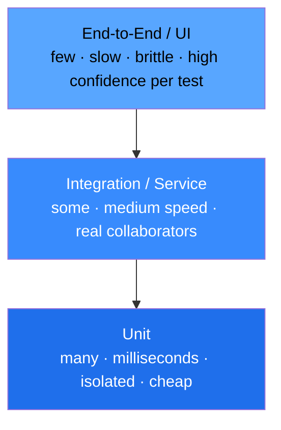
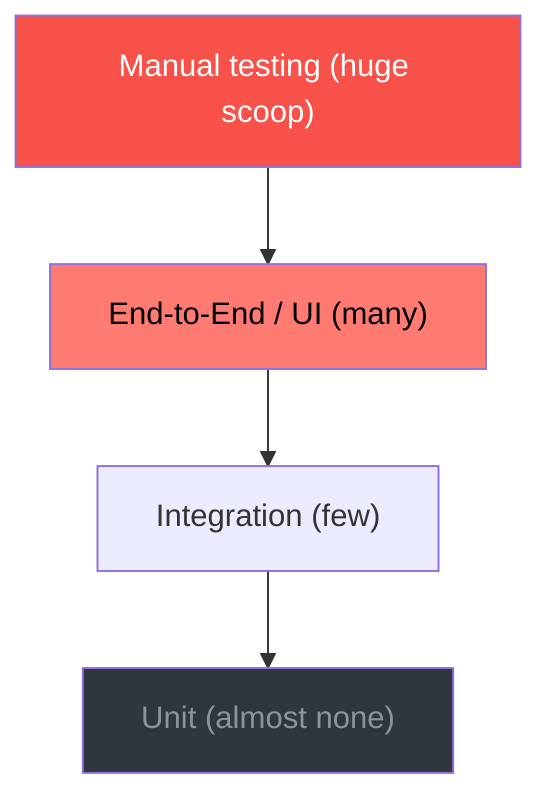
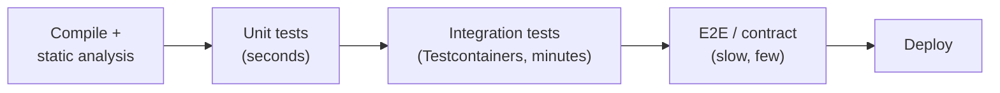
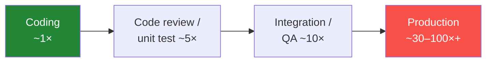

# Testing Fundamentals & the Test Pyramid

Automated testing is the discipline of proving — cheaply, repeatably, and *before* your
users do — that software does what it should and keeps doing it as the code changes.
This topic is the foundation for the whole testing domain: the vocabulary interviewers
expect you to use precisely (verification vs validation, test levels vs test types,
sociable vs solitary), the mental model for *how much* of each kind of test to write
(the **test pyramid** and its anti-patterns), and the principles that separate a test
suite that speeds a team up from one that grinds it to a halt.

The examples use the JVM stack (JUnit 5 / Jupiter, Mockito, AssertJ, Testcontainers)
because that is this library's default, but every principle here is language-agnostic —
stated neutrally first, then shown in Java.

> [!KEY-TAKEAWAY]
> A test suite has two jobs: **catch regressions** and **give fast, trustworthy
> feedback**. Every fundamental below — the pyramid, FIRST, isolation, shift-left —
> is a lever for maximizing *bugs caught per second of feedback* while keeping the
> suite cheap to maintain.

---

## Why we test

**Definition.** Testing is the process of evaluating software to find defects and to
build confidence that it meets its requirements. Automated tests encode that evaluation
as code that a machine re-runs on demand.

**Why it matters.** Testing is not about "proving there are no bugs" — Dijkstra's
famous line is that *testing can show the presence of bugs, but never their absence*.
The real goals are more pragmatic:

- **Regression protection** — let you change code without fear of silently breaking
  something that used to work. This is the single biggest ROI of automated tests.
- **Fast feedback** — surface a defect seconds after you introduce it, when it is
  cheapest to fix and you still have full context.
- **Executable specification** — a well-named test documents intended behavior more
  reliably than prose, because it cannot drift out of date without failing.
- **Design pressure** — code that is hard to test is usually badly coupled; writing
  tests first (**TDD** — Test-Driven Development, where you write a failing test before
  the code that satisfies it) surfaces that early.
- **Confidence to deploy** — a green suite is the gate that makes continuous delivery
  possible.

**Advanced framing.** Testing is a form of *risk management*, not a checkbox. You never
have infinite time, so you allocate testing effort to where the **cost of failure ×
probability of failure** is highest. Exhaustive testing is impossible (the input space
is effectively infinite), so you rely on techniques — equivalence partitioning,
boundary analysis, risk-based prioritization — to sample the input space intelligently.
The "absence-of-errors fallacy" is the trap of building software that passes all its
tests but doesn't solve the user's actual problem: green tests are necessary, not
sufficient.

> [!INTERVIEW]
> If asked "why test at all if it can't prove correctness?", answer with *economics*:
> tests aren't a proof, they're the cheapest available mechanism to catch regressions
> and shorten the feedback loop, and that speed is what lets teams ship safely and
> often.

---

## Verification and validation

These two words sound like synonyms but name **different questions**, and interviewers
love to check that you know the difference.

| | Verification | Validation |
|---|---|---|
| Question it answers | "Are we building the product **right**?" | "Are we building the **right** product?" |
| Checks against | The **specification / design** | The **user's actual needs** |
| Typical activities | Reviews, static analysis, unit & integration tests | Acceptance testing, UAT (User Acceptance Testing — real users verify it meets their needs), demos, beta programs |
| Boehm's phrasing | Conformance to spec | Fitness for purpose |

- **Verification** catches *implementation* defects — the code doesn't match the spec.
  Most automated tests are verification.
- **Validation** catches *requirements* defects — the spec itself was wrong, or the
  feature nobody needed got built perfectly. You can pass every unit test and still fail
  validation.

A system can be fully verified yet invalid (a flawlessly implemented feature users hate)
or valid in intent yet unverified (right idea, buggy code). You want both.

> [!TIP]
> Mnemonic: **V**erification = **V**s. the spec; **V**alidation = **V**alue to the user.

---

## Test levels and test types

Two orthogonal axes are constantly conflated. Keep them separate.

**Test *levels*** describe the **scope** — how much of the system a test exercises:

| Level | Scope | Example (JVM) |
|---|---|---|
| Unit | One class/function in isolation | JUnit test of a `PriceCalculator` |
| Integration | Several units + a real collaborator (DB, broker, HTTP) | Repository test against Postgres via Testcontainers |
| System / end-to-end | The whole deployed application | Driving the running service over HTTP |
| Acceptance | The system against business requirements | Cucumber/BDD scenario (BDD = Behavior-Driven Development; see [Shift-left testing](#shift-left-testing)), UAT |

**Test *types*** describe **what quality attribute** you're checking, independent of
level:

| Type | Checks | Sub-kinds |
|---|---|---|
| Functional | *What* the system does — behavior vs requirements | correctness, business rules |
| Non-functional | *How well* it does it — quality attributes | performance, load, security, usability, reliability, scalability |
| Structural | Internal structure / coverage | white-box, coverage-driven |
| Change-related | Confirming fixes / no regressions | regression, re-testing (confirmation) |

The key insight: **level and type are independent**. You can have a functional unit
test *and* a non-functional (performance) unit test (a JMH microbenchmark); a functional
E2E test *and* a non-functional E2E test (a Gatling load test). Interviewers probe this
when a candidate says "integration test" and means "non-functional test."

> [!WARNING]
> "Integration testing" is one of the most overloaded terms in the field. Always
> clarify *scope*: does it mean "two of my classes together" (narrow) or "my service
> plus a real database and a real Kafka" (broad)? The pyramid arguments hinge on which
> you mean.

---

## Black-box, white-box, and gray-box testing

These describe **how much of the internals the test knows about** — the visibility of
the implementation to the person designing the test.

- **Black-box testing** — derive tests purely from the *specification / interface*,
  ignoring the implementation. You feed inputs and assert on outputs. Techniques:
  equivalence partitioning, boundary-value analysis, decision tables, state transition.
  Strength: tests survive refactoring; weakness: can miss internal edge cases.
- **White-box (glass-box / structural) testing** — design tests *from the code*, aiming
  to exercise specific paths, branches, and conditions. Coverage metrics are white-box
  notions: **statement** (was each line executed?), **branch** (was each `if`/`else`
  direction taken?), and **MC/DC** — *Modified Condition/Decision Coverage*, which
  requires that each boolean sub-condition be independently shown to affect the decision's
  outcome (the rigorous standard used in safety-critical avionics). Strength: finds
  untested logic; weakness: tests couple to implementation and break on refactor.

**Coverage measures execution, not verification.** This is the single most important
caveat about coverage numbers: a metric tells you a line *ran*, not that anything
*checked* its result. A test with no meaningful assertions can drive line coverage to
100% while catching zero bugs. The technique that measures whether tests actually detect
faults is **mutation testing**: a tool (e.g., PIT for the JVM) deliberately injects small
changes ("mutants" — flip a `>` to `>=`, replace `+` with `-`) and re-runs the suite; a
mutant that survives — no test failed — reveals a gap your coverage number hid. See the
follow-up "Is 100% coverage a good goal?" below.
- **Gray-box testing** — a blend: you know *some* internals (e.g., that there's a cache
  or a DB) and use that to design smarter black-box-style tests, without asserting on
  private details. Most integration testing is effectively gray-box.

```java
// Black-box: we assert on observable behavior, not how it's computed.
@Test
void appliesTenPercentDiscountForOrdersOverHundred() {
    var price = calculator.finalPrice(new Order(150.00));
    assertThat(price).isEqualByComparingTo("135.00");
}
```

> [!INTERVIEW]
> A good rule of thumb to state: **prefer black-box-style assertions on behavior**
> (they let you refactor freely), and use white-box knowledge to *choose which cases to
> write*, not what to assert on. Coupling tests to private implementation detail is the
> #1 cause of brittle, refactor-hostile suites.

---

## The test pyramid

The **test pyramid** (popularized by Mike Cohn in *Succeeding with Agile*, 2009, and
elaborated by Martin Fowler) is a heuristic for the *proportions* of an automated test
suite: **many fast, cheap, isolated tests at the bottom; progressively fewer, slower,
broader tests as you go up.**



**Why the shape.** As you move up the pyramid, tests get **slower, more expensive to
write and maintain, more non-deterministic (flaky), and broader in scope** — a single
failure tells you *something* broke but not *where*. Lower tests are the opposite: a
failing unit test pinpoints the defect in milliseconds. So you push as much coverage as
possible *down* to the cheapest layer that can still catch the class of bug in question.

**The rules that actually matter** (more useful than any exact ratio):

1. **Write tests at different granularities.** Don't test everything at one level.
2. **The higher up you go, the fewer tests you should have.** Cost and flakiness grow
   faster than the marginal confidence each test adds.
3. **Push each test to the lowest level that can meaningfully catch its target bug.**
   Don't verify a rounding rule through a browser.

**Common ratios** cited (≈70% unit / 20% integration / 10% E2E) are *illustrative, not
prescriptive* — Fowler is explicit that the exact numbers matter far less than the
shape. Don't quote a ratio as gospel in an interview; explain the *cost/feedback*
reasoning instead.

**Make the shape concrete.** Imagine a healthy pyramid-shaped suite:

| Layer | Count | Total runtime | Per-test cost |
|---|---|---|---|
| Unit | 2,000 | ~25 s | ~12 ms, no I/O, deterministic |
| Integration | 300 | ~4 min | seconds each; real DB/broker via Testcontainers |
| E2E | 15 | ~9 min | tens of seconds each; whole system, occasionally flaky |

The whole thing runs in about 13 minutes and a unit failure names the broken line
instantly. Now invert it into an ice-cream cone testing the *same* behaviors — say 800
E2E tests at ~25 s each — and you're looking at roughly 6 hours of wall-clock time,
runs that flake daily, and failures that tell you "something in checkout broke" but not
where. Same coverage of behavior; wildly different feedback economics. That gap is the
entire argument for pushing coverage *down*.

**A key nuance interviewers reward:** the pyramid says *fewer* high-level tests, not
*zero*. E2E tests are your "second line of defense" — when one fails it often reveals
both a bug *and* a missing lower-level test, which you should then backfill with a fast
unit test that reproduces it.

> [!WARNING]
> The exact percentages are a trap. If an interviewer pushes "what's the right ratio?",
> the strong answer is: "It's a shape, not a formula — as many tests as low as
> possible; the ratio falls out of your architecture and how much logic lives in pure
> units vs I/O-bound integration points."

---

## The testing trophy and the ice-cream-cone anti-pattern

The pyramid isn't the only model, and its most important lesson is what happens when you
get the shape *wrong*.

**Ice-cream cone (the classic anti-pattern).** An *inverted* pyramid: many slow E2E/UI
tests, few integration tests, almost no unit tests — often topped with a huge blob of
**manual** testing (the "scoop"). This is what you get when teams bolt record-and-replay
UI tests onto an untested codebase. Symptoms: multi-hour CI runs, chronic flakiness,
failures that don't localize, and developers who stop trusting the suite. Fowler notes
record-playback UI testing "almost always" leads here.



**Testing trophy (Kent C. Dodds).** A response to the observation that, in some stacks
(notably front-end/JS, but the argument travels), **integration tests hit the sweet spot
of confidence-per-effort**. The shape is a trophy: a base of static analysis
(types, linting), a modest layer of unit tests, a *large* bulge of integration tests,
and a few E2E tests. The guiding slogan: *"Write tests. Not too many. Mostly
integration."*

**Reconciling them.** Much of the pyramid-vs-trophy debate is *definitional* — Fowler
points out that if you define "unit" broadly (sociable units that use real
collaborators), your "unit" tests look a lot like the trophy's "integration" tests.
The durable, non-controversial core both agree on:

- Static analysis / types are the cheapest defense — use them.
- Fast, isolated tests should dominate by *count*.
- Broad, slow tests should be *few* and reserved for critical end-to-end paths.

> [!INTERVIEW]
> If asked "pyramid or trophy?", don't pick a tribe. Say: "They optimize the same
> thing — confidence per unit of feedback time. The trophy just weights integration
> more heavily, which makes sense when your units are thin wrappers over I/O. Both
> agree: cheap fast tests dominate, slow E2E tests are few."

---

## Test scope and isolation

**Isolation** has two distinct meanings that interviewers separate:

**1. Isolation between tests (a correctness requirement).** Tests must not depend on
each other's order or shared mutable state. A test that only passes when run after
another (leaked static state, shared DB row, ordering assumption) is a defect. JUnit 5
gives each test method a **fresh test-class instance by default** (`PER_METHOD`
lifecycle) precisely to prevent field state leaking between tests.

**2. Isolation of the unit under test (a design choice) — sociable vs solitary.**
Fowler's terms for *how a unit test treats its collaborators*:

- **Solitary** — replace every collaborator with a **test double** (a stand-in object
  substituted for a real dependency) so the test exercises exactly one class. Failures
  localize perfectly; but you risk testing interactions that don't match reality, and
  tests couple to internal collaboration.
- **Sociable** — let the unit use its *real* collaborators (as long as they're fast and
  in-process), replacing only slow/awkward dependencies (DB, network, clock). More
  realistic, fewer mocks to maintain; a failure may implicate several classes.

**"Test double" is an umbrella term — the five kinds are distinct** (Meszaros's
taxonomy, popularized by Fowler). Interviewers dock points when a candidate uses "mock"
and "stub" interchangeably, because the crucial split is *state verification* (assert on
the result) vs *interaction/behavior verification* (assert on which calls were made):

| Double | What it does | Verifies |
|---|---|---|
| **Dummy** | Passed to satisfy a parameter but never used | nothing |
| **Stub** | Returns canned answers to calls made during the test | state (the result) |
| **Spy** | A stub that also *records* how it was called for later inspection | state + recorded calls |
| **Mock** | Pre-programmed with *expectations* about the calls it should receive; fails if they aren't met | interaction (the calls themselves) |
| **Fake** | A working but lightweight implementation (e.g., an in-memory DB, a `HashMap`-backed repository) | state, via real-ish behavior |

Mockito blurs the line in practice — its `mock()` objects act as stubs when you use
`when(...).thenReturn(...)` and as mocks when you `verify(...)` interactions — but keep
the *conceptual* distinction sharp for interviews.

```java
// Solitary: the collaborator is mocked, so only OrderService logic is under test.
@ExtendWith(MockitoExtension.class)
class OrderServiceSolitaryTest {
    @Mock InventoryClient inventory;
    @InjectMocks OrderService service;

    @Test
    void rejectsWhenOutOfStock() {
        when(inventory.available("sku-1")).thenReturn(0);
        assertThatThrownBy(() -> service.place("sku-1", 1))
            .isInstanceOf(OutOfStockException.class);
    }
}
```

Neither is universally right. Over-mocking (fully solitary everywhere) produces tests
that pass while the integrated system is broken and that shatter on every refactor;
never mocking makes failures hard to localize. The pragmatic default: **mock across
process/architectural boundaries (DB, network, message broker, clock, randomness),
use real objects within a boundary.**

> [!WARNING]
> Isolating a test from *shared state* is mandatory. Isolating a unit from *all
> collaborators* is a stylistic choice — and doing it reflexively (mocking value
> objects, mocking your own domain model) is a well-known smell.

---

## The fast-feedback principle

The **value of a test is inversely proportional to how long it takes you to learn it
failed.** A bug found one second after you type it costs almost nothing; the same bug
found in a nightly E2E run costs a context-switch, and in production costs an incident.

Consequences that drive suite design:

- **Unit tests must run in milliseconds** so you can run thousands on every save. A
  suite that takes 20 minutes won't be run before every commit, so it stops catching
  bugs early — its feedback value collapses even if its coverage is high.
- **Layer your CI stages** by speed so the cheapest tests gate first and fail fast:



- **Parallelize and shard** slower layers; keep the fast layer fast by never letting a
  DB or network sneak into a "unit" test.
- **Feedback speed is why the pyramid is shaped as it is** — it's the same principle
  viewed from the time axis.

> [!TIP]
> A practical heuristic: if your whole unit suite doesn't finish in the time it takes to
> read the failure message, developers will start committing without running it. Guard
> unit-suite runtime like a budget.

---

## What makes a good test: FIRST

The **FIRST** acronym (popularized in *Clean Code*, from Bob & Micah Martin) captures
the properties of a healthy unit test:

| Letter | Property | Meaning |
|---|---|---|
| **F** | Fast | Runs in milliseconds so it's run constantly. No sleeps, I/O, or heavy setup. |
| **I** | Isolated / Independent | No dependence on other tests, order, or shared mutable state; sets up its own fixtures. |
| **R** | Repeatable | Same result every run, in any environment — no dependence on wall-clock, timezone, network, random seeds, or "today's data." |
| **S** | Self-validating | Asserts a clear pass/fail with no human interpreting logs or eyeballing output. |
| **T** | Timely | Written at the right time — ideally just before/with the code (TDD), so it actually influences design. |

Beyond FIRST, good tests are **readable** (a failing test's name + message should tell
you what broke without opening the code), **behavior-focused** (assert observable
outcomes, not implementation), and follow **Arrange-Act-Assert** with **one logical
assertion / one reason to fail** per test. "One assertion" means *one behavior / one
reason to fail*, not literally one `assert` statement — asserting several fields of a
single returned object is fine, and *soft assertions* (JUnit's `assertAll`, AssertJ's
`SoftAssertions`) let you group them so all failures are reported at once instead of
stopping at the first. The smell to avoid is one test verifying several *unrelated*
behaviors.

**Good vs bad test:**

```java
// BAD: not repeatable (real clock), not fast (sleep), unclear failure, tests internals.
@Test
void badTest() throws Exception {
    var s = new SessionService();
    s.start();
    Thread.sleep(1000);                      // slow + flaky
    assertTrue(s.getInternalMap().size() > 0); // asserts private structure
    assertEquals(new Date().getDay(), s.today()); // depends on wall clock
}

// GOOD: fast, repeatable (injected clock), self-validating, asserts behavior.
@Test
void expiresSessionAfterTimeout() {
    var clock = Clock.fixed(Instant.parse("2026-01-01T00:00:00Z"), ZoneOffset.UTC);
    var service = new SessionService(clock, Duration.ofMinutes(30));
    var session = service.start("user-1");

    var later = service.at(clock.instant().plus(Duration.ofMinutes(31)));
    assertThat(later.isExpired(session)).isTrue();
}
```

The single most common FIRST violation in real suites is **non-repeatability from time
and randomness** — inject a `Clock` and seed your RNG rather than calling `Instant.now()`
or `Math.random()` directly.

> [!INTERVIEW]
> Expect "what makes a good unit test?" as a warm-up. Recite FIRST, then add the two
> the acronym omits that seniors care about: **readable** and **tests behavior, not
> implementation.**

---

## Regression testing

**Definition.** *Regression* is when a change breaks previously-working functionality.
**Regression testing** is re-running existing tests after a change to confirm nothing
that used to work is now broken. It's distinct from **re-testing / confirmation
testing**, which re-runs the *specific* failing test after a bug fix to confirm *that
bug* is gone.

| | Confirmation (re-test) | Regression |
|---|---|---|
| Purpose | Verify a specific fix works | Verify the fix broke nothing else |
| Scope | The one failed case | Broad — the surrounding/related suite |

**Why it matters.** Regression protection is the *primary business value* of an
automated suite: it's what lets a team refactor and add features at speed without fear.
Every reproduced production bug should become a permanent regression test so it can never
silently return.

**Advanced concerns.** As suites grow, running *everything* on every change gets
expensive — hence **regression test selection** (run only tests affected by the change,
via coverage/impact analysis), **test prioritization** (run most-likely-to-fail first),
and **suite minimization** (prune redundant tests). Concretely: a commit changes
`OrderService.java`; a coverage map shows only 40 of the 2,000 tests ever execute that
file, so CI runs those 40 first (selection + prioritization) for fast feedback and
defers the full suite to a nightly run. The classic pitfall of aggressive minimization
is deleting a test whose *only* job was pinning a subtle edge case.

> [!TIP]
> Turn every bug into a test: reproduce the defect with a failing test *first*, then
> fix it. The test both proves your fix and guards the fix forever (a permanent
> regression test).

---

## Smoke testing and sanity testing

Both are *shallow, fast subsets* run to decide whether deeper testing is even worthwhile
— but they answer different questions.

- **Smoke testing** — a *broad, shallow* check that the build's **critical paths work at
  all** ("does it even turn on without smoke?"). Run right after a build/deploy as a
  **build-verification test (BVT)**: can the app start, can users log in, does the health
  endpoint respond, can you place one order? If smoke fails, you reject the build before
  wasting time on the full suite.
- **Sanity testing** — a *narrow, deeper* check that **one specific new change or fix
  behaves rationally** before committing to full regression. Typically unscripted and
  focused on the area just touched.

| | Smoke | Sanity |
|---|---|---|
| Breadth vs depth | Wide & shallow | Narrow & deep |
| When | After every build/deploy | After a specific change/fix |
| Question | "Is the build stable enough to test?" | "Does this change work sensibly?" |
| Scripted? | Usually automated/scripted | Often ad-hoc |

> [!WARNING]
> These terms are used loosely in industry and some teams treat them as synonyms. In an
> interview, define them the way above (breadth vs depth, build-level vs change-level)
> and note the ambiguity — that shows awareness rather than pedantry.

---

## Shift-left testing

**Definition.** *Shift-left* means moving testing (and quality activities generally)
**earlier** in the development lifecycle — to the *left* on a timeline that runs
requirements → design → code → test → release. Instead of a separate QA phase after
development, quality is built in from the start.

**Concrete practices:**

- Developers write automated tests alongside (or before, via TDD) the code.
- Static analysis, linting, type checks, and security scanning (SAST) run in CI on every
  commit — *shift-left security* / DevSecOps.
- Requirements are clarified with executable examples (**BDD** — Behavior-Driven
  Development, expressing requirements as Given/When/Then scenarios that double as
  tests — or specification by example) *before* coding.
- Contract tests catch integration mismatches at build time, not in a shared staging
  environment.

**Why it matters — the cost curve.** The rationale is economic: defects get
exponentially more expensive to fix the later they're found (see next section). Shifting
left catches them when they're cheapest. The counterpart, **shift-right**, complements it
by testing in production (canaries, feature flags, observability, chaos engineering) —
you shift left to *prevent* and right to *detect what prevention missed*. Modern practice
does both.

> [!INTERVIEW]
> "Shift-left" is a buzzword; ground it. It's not a tool, it's *moving the discovery of
> defects earlier* — enabled concretely by developer-owned automated tests, CI gates,
> and clarifying requirements with examples up front.

---

## The cost of a bug over time

**The principle.** The cost to fix a defect grows the longer it survives undetected —
roughly, each phase it slips through multiplies the cost. A bug caught while typing costs
seconds; the same bug caught in code review costs minutes; in QA, hours; in production,
potentially an incident, data corruption, customer trust, and emergency response.



**Why the multiplier.** A late-discovered bug is expensive not because the fix itself is
harder, but because of everything around it: you've lost context and must re-learn the
code; other work has been built on top of the bug; diagnosis across a full system is
slow; a production defect adds incident response, communication, possible rollback, and
reputational cost.

**Interview-grade nuance.** The specific "1-10-100" or "×IBM-System-Science" multipliers
are widely cited but come from old studies (Boehm, NIST) whose exact numbers are debated
and don't map cleanly to modern iterative/CD workflows. **Cite the *direction and
mechanism* confidently; hedge on exact multipliers.** The trend — later = costlier — is
the robust part, and it's *the* economic justification for the entire pyramid, FIRST,
fast feedback, and shift-left. This is why we invest in cheap tests that fail fast: we're
buying down the cost of the bugs we'd otherwise find late.

> [!KEY-TAKEAWAY]
> Every fundamental in this topic serves one economic goal: **find each defect at the
> cheapest possible moment.** The pyramid, fast feedback, FIRST, and shift-left are all
> different tactics for the same strategy — shrinking the time (and therefore cost)
> between introducing a bug and discovering it.

---

## Common follow-up questions

- "Can testing prove your code is correct?" No — testing shows the presence of bugs,
  not their absence (Dijkstra). It builds *confidence* and catches *regressions*; it's
  risk management, not proof. Formal methods prove; tests sample.
- "What's the difference between a test level and a test type?" Level = scope (unit /
  integration / system / acceptance); type = quality attribute checked (functional /
  performance / security / …). They're orthogonal: you can have a non-functional unit
  test and a functional E2E test.
- "What exact ratio should the pyramid be?" It's a shape, not a formula — many fast
  low-level tests, few slow high-level ones. The ratio falls out of your architecture;
  don't quote 70/20/10 as a rule.
- "Is 100% coverage a good goal?" No — coverage measures whether code *ran*, not
  whether anything *checked* the result, so assertion-free tests can hit 100% while
  catching nothing. Treat coverage as a way to find *un*tested code (low numbers are a
  real signal), not as proof of quality; chasing the last few percent tends to produce
  brittle, low-value tests. To measure whether tests actually catch bugs, use **mutation
  testing** (inject faults; a surviving mutant is a real gap).
- "Pyramid vs testing trophy — which is right?" Both optimize confidence-per-feedback-
  second; the trophy just weights integration more (sensible when units are thin I/O
  wrappers). The debate is largely about how you define "unit."
- "My E2E suite is flaky and takes an hour. What do you do?" Diagnose the ice-cream
  cone: push coverage down to unit/integration, reserve E2E for a few critical journeys,
  make each reproduced flake into a fast deterministic lower test, stabilize time/network
  dependencies.
- "Verification vs validation?" Verification = building it right (vs the spec);
  validation = building the right thing (vs user needs). You can pass all tests and still
  fail validation.
- "What makes a good unit test?" FIRST — Fast, Isolated, Repeatable, Self-validating,
  Timely — plus readable and behavior-focused (not coupled to implementation).
- "Smoke vs sanity?" Smoke = wide & shallow build-verification ("does it turn on?");
  sanity = narrow & deep check of one change ("does this fix behave?").
- "Why write tests first (shift-left)?" Because defect cost rises the later they're
  found; catching them at coding time is cheapest and improves design.

## References

- Martin Fowler — [TestPyramid](https://martinfowler.com/bliki/TestPyramid.html),
  [UnitTest](https://martinfowler.com/bliki/UnitTest.html) (solitary vs sociable),
  [TestDouble](https://martinfowler.com/bliki/TestDouble.html)
- Mike Cohn — *Succeeding with Agile* (2009), the original "Test Automation Pyramid"
- Kent C. Dodds — [The Testing Trophy and Testing Classifications](https://kentcdodds.com/blog/the-testing-trophy-and-testing-classifications)
  and "Write tests. Not too many. Mostly integration."
- Robert C. Martin — *Clean Code* (2008), the FIRST principles
- Kent Beck — *Test-Driven Development: By Example* (2002)
- Barry Boehm — *Software Engineering Economics* (1981), cost-of-change / verification vs
  validation; NIST 2002 report on the economics of software defects
- Edsger Dijkstra — "Testing shows the presence, not the absence of bugs" (*Notes on
  Structured Programming*, 1970)
- ISTQB Foundation Level Syllabus — test levels, types, verification/validation, smoke/
  sanity, regression/confirmation testing definitions
- [JUnit 5 User Guide](https://docs.junit.org/current/user-guide/) — test lifecycle and
  per-method isolation
- [Mockito documentation](https://javadoc.io/doc/org.mockito/mockito-core/latest/org/mockito/Mockito.html)
  — mocks/stubs and `MockitoExtension`
