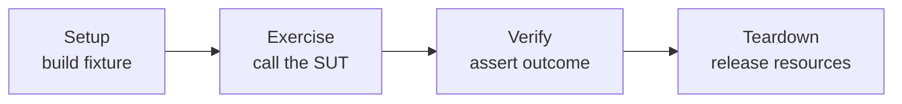

# Unit Testing Principles & Practices

Unit testing is the discipline of writing small, fast, automated checks that exercise one
"unit" of behavior in isolation and assert its observable result. It is the base of the test
pyramid: the layer you have the most of because unit tests are cheap to write, fast to run, and
precise when they fail. This topic covers the *principles* that make unit tests trustworthy —
what a unit is, how to structure a test, what makes tests deterministic and readable, and the
common anti-patterns interviewers probe. Principles are stated framework-neutrally first, then
shown with idiomatic **JUnit 5 (Jupiter)**, **Mockito**, and **AssertJ**.

> [!INTERVIEW]
> The single most common senior-level unit-testing question is not "what is a unit test" but
> "what makes a unit test *good* — and what makes one *flaky or brittle*?" Everything below
> feeds that answer: isolation, determinism, one reason to fail, readability, and testing
> behavior rather than implementation.

For Spring-specific test slices (`@WebMvcTest`, `@DataJpaTest`, `@SpringBootTest`, `MockMvc`) see
the `spring-boot/testing-spring-boot-applications` and `spring-core/testing-spring-applications`
topics — this topic owns the general discipline and only points at those.

---

## What Is a Unit (Solitary vs Sociable)

**Beginner.** A *unit* is the smallest testable piece of behavior — typically a method or a small
cluster of classes that implement one responsibility. A *unit test* exercises that unit in
isolation from the rest of the system (no real database, network, filesystem, clock, or other
process) so it is fast and its failures point at one place.

A common misconception is that "unit == one class." A unit is a unit of *behavior*, not a unit of
*code*. A single behavior may legitimately span a handful of collaborating classes (e.g. a value
object, a small helper, and the class under test).

**Intermediate — solitary vs sociable (Fowler's terms, from Jay Fields).** The key axis is how a
test treats the unit's *collaborators*:

| Style | Collaborators | Test double use | Failure signal |
|---|---|---|---|
| **Solitary** | Every collaborator is replaced with a test double | Heavy mocking/stubbing | Failure localizes to the one class; but tests couple to interactions |
| **Sociable** | Real collaborators are used; only awkward dependencies (DB, network, clock) are doubled | Minimal doubling | Failure may implicate several classes; tests are more robust to refactoring |

Solitary tests isolate a class from *all* its neighbors; sociable tests let a class use its real
neighbors and only stub out the "awkward" boundaries. Neither is universally correct — solitary
tests give sharp failure localization but can ossify internal structure; sociable tests survive
refactoring better but a single bug can fail many tests.

**Advanced — classical vs mockist / London vs Detroit.** This maps to two TDD schools:

- **Classicist (Detroit / "state-based")**: prefer sociable tests with real objects, verify the
  *resulting state / return value*. Mock only true external dependencies.
- **Mockist (London / "interaction-based")**: prefer solitary tests, mock all collaborators, and
  verify *interactions* (which methods were called). Enables outside-in TDD and testing before
  collaborators exist, but couples tests to implementation and produces more brittle tests.

The mainstream modern advice (and the one to give in interviews) is: **default to sociable /
state-based testing, use mocks primarily at architectural boundaries** (I/O, third-party
services, non-determinism). Over-mocking is a leading cause of tests that pass while the system is
broken.

> [!KEY-TAKEAWAY]
> A unit is a unit of *behavior*, not a class. "Solitary" = isolate from collaborators via
> doubles; "sociable" = use real collaborators, double only awkward boundaries. Prefer verifying
> *state* over *interactions* unless the interaction *is* the behavior.

---

## Arrange-Act-Assert and Given-When-Then

**Beginner.** A good test has three clearly separated phases. Two naming conventions describe the
same shape:

- **AAA — Arrange, Act, Assert**: set up inputs and doubles; invoke the unit; assert the outcome.
- **GWT — Given, When, Then** (from BDD): *Given* a context, *When* an action occurs, *Then* an
  outcome is expected.

They are structurally identical; GWT phrases it in behavior/business language and is common in
BDD tools (Cucumber, Spock). Keeping the three phases visually distinct (a blank line between
them) makes tests scannable.

```java
@Test
void withdraw_reducesBalance_whenFundsSufficient() {
    // Arrange
    Account account = new Account(Money.of(100));

    // Act
    account.withdraw(Money.of(30));

    // Assert
    assertThat(account.balance()).isEqualTo(Money.of(70));
}
```

**Intermediate — one action.** The **Act** should be a *single* call to the unit under test. If a
test has several "act" steps, it is usually testing several behaviors and should be split. A
recurring smell is interleaving multiple act/assert pairs in one test — that is really several
tests wearing one `@Test`.

**Advanced — the fourth phase and Arrange leakage.** Complex tests often need a **teardown** phase
(see *The Four-Phase Test*). Also watch for "arrange creep": if the Arrange block dwarfs the rest,
the unit likely has too many dependencies (a design smell surfaced by the test), or the fixture
setup belongs in a `@BeforeEach` / builder / Object Mother. Beware pushing *behavior-relevant*
setup into `@BeforeEach` where it becomes invisible to the reader of a single test (see DAMP vs
DRY).

---

## The Four-Phase Test

**Beginner.** Gerard Meszaros (*xUnit Test Patterns*) generalizes test structure into four phases:

1. **Setup** — establish the fixture (the state the test needs).
2. **Exercise** — invoke the system under test (SUT).
3. **Verify** — check the outcome against expectations.
4. **Teardown** — release any resources so tests don't leak into each other.

AAA collapses phases 1–3 (teardown is often automatic in unit tests because objects are
garbage-collected). Teardown becomes explicit when a test touches real resources (files, temp
dirs, containers, threads).



**Intermediate — where JUnit fits.** In JUnit 5, `@BeforeEach`/`@AfterEach` run around *every*
test method; `@BeforeAll`/`@AfterAll` run once per class. Prefer `@BeforeEach` for per-test setup
so tests stay independent. Use try-with-resources or JUnit's `@TempDir` for teardown of real
resources rather than manual `@AfterEach` cleanup that can be skipped on failure.

**Advanced — teardown correctness.** Teardown must run even when the test fails. `@AfterEach`
runs regardless of assertion outcome, but if setup throws, later phases don't run. Shared mutable
state that isn't torn down is a top cause of order-dependent, flaky tests. Idempotent, isolated
fixtures (fresh object per test) beat shared fixtures that require careful cleanup.

---

## FIRST Properties

**Beginner.** FIRST is a mnemonic (popularized by *Clean Code* / Tim Ottinger & Brett Schuchert)
for the qualities of good unit tests:

| Letter | Property | Meaning |
|---|---|---|
| **F** | Fast | Milliseconds each; you must be able to run thousands routinely. |
| **I** | Isolated / Independent | No dependence on other tests or on run order; each sets up its own fixture. |
| **R** | Repeatable | Same result every run, in any environment (no reliance on clock, network, machine). |
| **S** | Self-validating | Passes/fails automatically via assertions — no human reading logs. |
| **T** | Timely / Thorough | Written close to the code (ideally test-first); cover the meaningful cases. |

**Intermediate — why each matters.** *Fast* keeps the feedback loop tight enough to run tests on
every save; slow suites get skipped. *Isolated* means you can run one test alone and in parallel;
shared state breaks this. *Repeatable* is the enemy of flakiness. *Self-validating* rules out
"tests" that only print output. The **T** is sometimes read as *Timely* (write tests promptly,
before or with the code) and sometimes *Thorough* (cover edge cases, errors, boundaries).

**Advanced — Isolation enables parallelism.** JUnit 5 can run tests in parallel
(`junit.jupiter.execution.parallel.enabled=true`). Only truly isolated tests are safe to
parallelize; hidden shared state (static fields, singletons, a shared DB row, system properties)
produces intermittent failures that appear only under concurrency. FIRST's "I" and "R" are what
make CI parallelism possible.

> [!KEY-TAKEAWAY]
> If you can name only one property to protect, protect **Repeatable/Isolated** — non-determinism
> and cross-test coupling are what turn a green suite into one nobody trusts.

---

## Test Naming Conventions

**Beginner.** A test name should describe the *behavior* being verified, so a failure in a CI log
reads like a requirement. Poor names (`test1`, `testWithdraw`) tell you nothing when they go red.

**Intermediate — common patterns.** Several conventions are widely used; pick one and be
consistent:

| Convention | Example |
|---|---|
| `methodUnderTest_stateOrInput_expectedBehavior` | `withdraw_insufficientFunds_throwsException` |
| `should_expected_when_condition` | `shouldThrowWhenFundsInsufficient` |
| Given/When/Then sentence | `givenInsufficientFunds_whenWithdraw_thenThrows` |
| Plain sentence (via `@DisplayName`) | `@DisplayName("withdrawing more than the balance is rejected")` |

JUnit 5's `@DisplayName` decouples the human-readable label from the Java method name, so you can
keep a concise method name and a full-sentence description that shows in reports and IDEs.

```java
@Test
@DisplayName("withdrawing more than the balance throws InsufficientFundsException")
void withdraw_amountExceedsBalance_throws() { /* ... */ }
```

**Advanced — the name is a spec.** Good names encode three things: the scenario, the input/state,
and the expected outcome. If you can't name a test without "and," it probably tests two behaviors.
Names that describe *implementation* ("callsRepositorySave") rather than *behavior* ("persistsOrder")
are a mockist smell — they break when you refactor internals even though behavior is unchanged.

---

## One Assertion Per Test

**Beginner.** The guideline "one assertion per test" is really **one *behavior* / one logical
concept per test** — so a failure names exactly one reason. It is often misread as "literally one
`assert` statement."

**Intermediate — the real rule.** Multiple physical assertions are fine when they collectively
verify *one* outcome (e.g. checking several fields of a returned object). What you should avoid is
asserting *unrelated* behaviors in one test, because then a single failure hides others and the
test name can't describe what broke.

```java
// Fine: several assertions, one logical outcome (the created order)
Order order = service.place(cart);
assertThat(order.status()).isEqualTo(CONFIRMED);
assertThat(order.total()).isEqualTo(Money.of(42));
assertThat(order.lines()).hasSize(2);
```

**Advanced — fail-fast vs see-everything, and soft assertions.** By default JUnit stops at the
first failing assertion, so a later assertion's failure is masked until you fix the first. Two
tools address this:

- `assertAll(...)` (JUnit 5) groups assertions so *all* are evaluated and every failure is
  reported together — useful for verifying multiple properties of one result.
- AssertJ `SoftAssertions` (or `@ExtendWith(SoftAssertionsExtension.class)`) do the same for
  fluent assertions.

```java
assertAll("order",
    () -> assertEquals(CONFIRMED, order.status()),
    () -> assertEquals(Money.of(42), order.total()),
    () -> assertEquals(2, order.lines().size()));
```

Use `assertAll` for related facts about one outcome; do **not** use it to smuggle several
behaviors into one test.

---

## Testing Exceptions

**Beginner.** You must test the *unhappy paths*: that invalid input or state produces the right
exception. In JUnit 5 the idiom is `assertThrows`, which fails if the code does *not* throw and
returns the caught exception so you can assert on its message/type.

```java
@Test
void withdraw_insufficientFunds_throwsWithMessage() {
    Account account = new Account(Money.of(10));

    InsufficientFundsException ex = assertThrows(
        InsufficientFundsException.class,
        () -> account.withdraw(Money.of(50)));

    assertThat(ex.getMessage()).contains("insufficient");
}
```

**Intermediate — scope the executable tightly.** The lambda passed to `assertThrows` should
contain *only* the call expected to throw. If you wrap the Arrange code inside it too, an
exception from setup would be mistaken for the expected one. `assertThrows` accepts any subtype of
the declared type; `assertThrowsExactly` requires the *exact* class (no subclasses), which matters
when a hierarchy of exceptions exists.

**Advanced — pitfalls and alternatives.**
- The old JUnit 4 `@Test(expected = X.class)` couldn't assert on the message and couldn't scope
  *which* statement threw — JUnit 5 deliberately dropped it in favor of `assertThrows`.
- AssertJ's `assertThatThrownBy(...)` / `assertThatExceptionOfType(...).isThrownBy(...)` allow
  fluent chaining: `.hasMessageContaining(...)`, `.hasCauseInstanceOf(...)`, `.hasNoCause()`.
- Verify the *cause chain* when wrapping exceptions (e.g. a service wraps a `SQLException` in a
  domain exception). Asserting only the outer type can hide a mis-wired cause.
- Don't over-assert on exact message strings; assert on type and a stable substring so tests
  don't break on wording tweaks.

---

## Testing Edge Cases and Boundaries

**Beginner.** Bugs cluster at *boundaries*. Beyond the "happy path," test the edges: empty
collections, zero, negative numbers, the minimum and maximum valid values, `null`, and off-by-one
neighbors of a limit.

**Intermediate — boundary value analysis & equivalence partitioning.** These are classic
black-box techniques:

- **Equivalence partitioning**: group inputs that should behave the same (e.g. "valid age 18–65")
  and test one representative per partition — you don't need every value.
- **Boundary value analysis**: for each partition, test the values *at* and *just outside* the
  edges (17/18 and 65/66) because that's where off-by-one and `<` vs `<=` errors live.

Parameterized tests (`@ParameterizedTest` with `@ValueSource` / `@CsvSource`) are the natural fit
for exercising many boundary values without duplicating test bodies (see the
`parameterized-and-data-driven-tests` topic).

```java
@ParameterizedTest
@CsvSource({ "17,false", "18,true", "65,true", "66,false" })
void eligibility_atAndAroundBoundaries(int age, boolean expected) {
    assertThat(policy.isEligible(age)).isEqualTo(expected);
}
```

**Advanced — the "just enough" tension.** Test *meaningful* edges, not a combinatorial explosion.
Property-based testing (jqwik) generalizes boundary testing by generating many inputs and checking
invariants, and shrinks failing cases to a minimal counterexample — powerful for finding
boundaries you didn't think of. For numbers, remember overflow (`Integer.MAX_VALUE + 1`),
floating-point precision, and empty vs single-element vs many for collections.

---

## Deterministic Tests (No Time, Random, or I/O Dependence)

**Beginner.** A test must produce the same verdict every run. The three classic sources of
non-determinism are **time** (`new Date()`, `LocalDateTime.now()`), **randomness**
(`Random`, `UUID.randomUUID()`), and **I/O / ordering** (network, filesystem, iteration order of a
`HashMap`, thread scheduling). Code that reaches for these directly is hard to test
deterministically.

**Intermediate — inject the source of non-determinism.** The fix is to make the dependency
*explicit* and substitutable:

- **Time**: depend on a `java.time.Clock`. In production pass `Clock.systemUTC()`; in tests pass
  `Clock.fixed(instant, zone)`. Never call `Instant.now()` directly in domain code you want to test.
- **Randomness**: inject a `Random`/`RandomGenerator` (or an ID generator interface) so tests can
  supply a seeded or stubbed instance.
- **I/O**: hide behind an interface and stub it; use in-memory fakes or Testcontainers for
  integration-level checks.

```java
class InvoiceService {
    private final Clock clock;
    InvoiceService(Clock clock) { this.clock = clock; }
    Invoice issue() { return new Invoice(LocalDate.now(clock)); }  // uses injected clock
}

@Test
void issue_stampsFixedDate() {
    Clock fixed = Clock.fixed(Instant.parse("2026-07-20T00:00:00Z"), ZoneOffset.UTC);
    Invoice inv = new InvoiceService(fixed).issue();
    assertThat(inv.date()).isEqualTo(LocalDate.of(2026, 7, 20));
}
```

**Advanced — sneaky non-determinism.** `Thread.sleep`-based timing, relying on
`HashMap`/`HashSet` iteration order, default locale/timezone, tests that depend on the order JUnit
runs methods, and shared static state across tests all cause "works on my machine / fails in CI"
flakiness. Assert on *sets* not *lists* when order isn't guaranteed; pin locale/timezone; never
`sleep` to wait for async work — use awaitility-style polling with a timeout. See the
`test-automation-in-cicd-and-flaky-tests` topic for the full flakiness taxonomy.

> [!WARNING]
> `assertTimeoutPreemptively` runs the code in a *separate* thread and aborts it on timeout. That
> can break code relying on `ThreadLocal` (e.g. transaction/security context) and can leak the
> interrupted thread. Prefer plain `assertTimeout` unless you specifically need preemption.

---

## Avoiding Logic in Tests

**Beginner.** Tests should be *dumb and obvious*. Conditionals (`if`/`switch`), loops, arithmetic,
and try/catch inside a test body add places for the test itself to be wrong — and a bug in a test
is worse than no test because it gives false confidence.

**Intermediate — why logic is dangerous.** If a test computes its own expected value with the same
formula as production code, it will agree with a buggy implementation. Prefer *literal, hard-coded*
expected values ("golden" values) a human verified, not values re-derived at runtime.

```java
// BAD: test re-implements the logic it's checking — a shared bug passes silently
int expected = price * qty * (1 - discountRate);
assertThat(cart.total()).isEqualTo(expected);

// GOOD: known input, known literal answer
Cart cart = new Cart().add(item("book", 10_00), 3).withDiscount(10);
assertThat(cart.total()).isEqualTo(Money.of(27_00)); // 3 x $10 - 10%
```

**Advanced — replace loops/branches with parameterization.** A `for` loop over cases becomes a
`@ParameterizedTest`; an `if` that runs different assertions per input means you've merged two
tests — split them. Manual try/catch to test exceptions should be `assertThrows`. The rule of
thumb: *if a reviewer can't tell the expected outcome by reading the test without running it, the
test has too much logic.*

---

## Test Readability: DAMP vs DRY

**Beginner.** Production code favors **DRY** (Don't Repeat Yourself). Test code favors **DAMP**
(Descriptive And Meaningful Phrases) — a *controlled* amount of duplication that keeps each test
self-explanatory is preferable to clever abstraction that forces the reader to jump around.

**Intermediate — the trade-off.** Over-DRYing tests (giant shared `@BeforeEach`, deep helper
hierarchies, one parameterized test to rule them all) hides the cause-and-effect that a test is
supposed to show. A reader lands on a failing test and can't see the inputs because they're
assembled three layers away. DAMP says: keep the *relevant* setup visible in the test, even if it
repeats a little.

| | DRY (good for prod) | DAMP (good for tests) |
|---|---|---|
| Goal | Eliminate duplication | Maximize clarity of each test |
| Shared setup | Aggressive extraction | Only extract *irrelevant/incidental* setup |
| Failure debugging | — | Everything the test asserts is visible locally |

**Advanced — reconciling them.** The nuance: eliminate duplication that is *incidental* (object
construction boilerplate → Test Data Builders / Object Mother; wiring → `@BeforeEach`) but keep
duplication that is *essential to understanding a specific test* (the particular inputs and the
expected result). Builders (`anOrder().withStatus(PAID).build()`) give you both DRY construction
and DAMP readability. Beware the "mystery guest": a test whose behavior depends on data defined
elsewhere (external file, shared fixture) that the reader can't see.

> [!TIP]
> Test Data Builders are the sweet spot: they remove *incidental* construction duplication (DRY)
> while letting each test spell out only the *essential* fields it cares about (DAMP).

---

## Test Fixtures and Setup/Teardown

**Beginner.** A *fixture* is the fixed state a test runs against (objects, data, doubles). JUnit 5
lifecycle hooks build and dispose it:

| Annotation | When | Typical use |
|---|---|---|
| `@BeforeEach` | Before *every* test method | Build fresh per-test fixture |
| `@AfterEach` | After every test method | Release per-test resources |
| `@BeforeAll` | Once before all tests in the class | Expensive shared setup (e.g. start a container) |
| `@AfterAll` | Once after all tests | Shut down shared resources |

**Intermediate — fresh vs shared fixtures, and the static rule.** With JUnit 5's *default*
lifecycle (`PER_METHOD`), a **new test-class instance is created for each `@Test` method**, so
instance fields are reset between tests — this is what keeps tests isolated. Because of that,
`@BeforeAll`/`@AfterAll` methods must be **`static`** by default (no instance exists yet). If you
annotate the class with `@TestInstance(Lifecycle.PER_CLASS)`, one instance is reused for all
tests, `@BeforeAll`/`@AfterAll` may be non-static, but you take on the risk of state bleeding
between tests.

```java
class OrderServiceTest {
    private OrderService service;      // fresh instance per test (PER_METHOD default)

    @BeforeEach
    void setUp() { service = new OrderService(new InMemoryOrders()); }

    @AfterEach
    void tearDown() { /* usually nothing for pure-memory fixtures */ }
}
```

**Advanced — fixture strategies and their costs.**
- **Fresh fixture** (rebuild per test): safest, most isolated; default choice.
- **Shared fixture** (`@BeforeAll` / `PER_CLASS`): faster when setup is expensive (a Testcontainer,
  a big in-memory dataset) but re-introduces coupling — tests can't assume clean state and order
  starts to matter. Combine with per-test cleanup (transaction rollback, truncate) to regain
  isolation.
- Use `@TempDir` for filesystem fixtures (auto-cleaned), and prefer builders/Object Mothers over
  fat `@BeforeEach` blocks so each test controls the fixture fields it cares about (DAMP).
- Avoid *mutable static* fixtures shared across tests — the classic source of order-dependent
  flakiness.

---

## Common follow-up questions

- **"Is a unit test the same as testing a single class?"** No — a unit is a unit of *behavior*.
  Sociable tests deliberately use real collaborators; you double only awkward boundaries.
- **"Should I mock everything?"** No. Default to state-based/sociable testing; mock at
  architectural boundaries (I/O, time, randomness, third parties). Over-mocking couples tests to
  implementation and lets tests pass while the system is broken.
- **"One assertion per test — literally?"** No: one *behavior* per test. Multiple assertions on
  one outcome are fine; use `assertAll`/soft assertions to report them together.
- **"How do I test code that uses the current time / random UUIDs?"** Inject a `Clock` and a
  random/ID generator; substitute fixed/seeded values in tests. Never call `now()`/`randomUUID()`
  directly in testable domain logic.
- **"Why is my test green locally but flaky in CI?"** Usually hidden shared state, run-order
  dependence, reliance on `HashMap` iteration order, timing/`sleep`, or default locale/timezone —
  all FIRST "Isolated/Repeatable" violations.
- **"AAA vs Given-When-Then — which?"** Same structure; GWT is the BDD phrasing. Keep the three
  phases visually separated and have exactly one *Act*.
- **"DRY or DAMP for tests?"** DAMP: keep essential inputs/expectations visible per test; extract
  only incidental boilerplate (via builders/`@BeforeEach`).
- **`assertThrows` vs `assertThrowsExactly`?** The former accepts subclasses; the latter requires
  the exact type. Scope the lambda to only the throwing call.
- **Why must `@BeforeAll` be static?** Because the default `PER_METHOD` lifecycle creates a new
  instance per test, so no instance exists for a once-per-class hook — unless you switch to
  `PER_CLASS`.

## References

- Martin Fowler, "UnitTest" — https://martinfowler.com/bliki/UnitTest.html (solitary vs sociable,
  classical vs mockist)
- Martin Fowler, "Mocks Aren't Stubs" — https://martinfowler.com/articles/mocksArentStubs.html
- Kent Beck, *Test-Driven Development: By Example* — foundational TDD/xUnit structure
- Gerard Meszaros, *xUnit Test Patterns* — four-phase test, fixtures, test smells;
  http://xunitpatterns.com/
- Robert C. Martin / Tim Ottinger & Brett Schuchert, *Clean Code* — FIRST properties
- JUnit 5 User Guide — https://docs.junit.org/current/user-guide/ (assertions, `assertThrows`,
  `assertAll`, `assertTimeout`/`assertTimeoutPreemptively`, lifecycle, test instance lifecycle)
- Mockito documentation & `MockitoExtension` (STRICT_STUBS default) — https://site.mockito.org/
- AssertJ documentation — https://assertj.github.io/doc/ (`assertThatThrownBy`, `SoftAssertions`)
- Google Testing Blog, "Prefer Debugging-Friendly Tests" / DAMP-not-DRY guidance —
  https://testing.googleblog.com/
- jqwik (property-based testing for the JVM) — https://jqwik.net/
